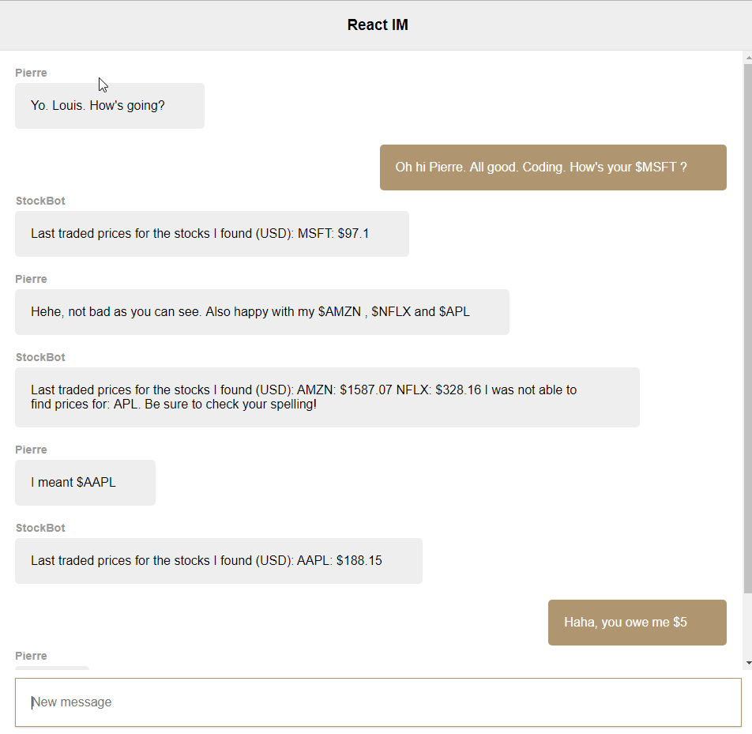

# react-IM-stocks

A Facebook messenger style chat application with live stock prices.
This project builds on [paul pagnan's react-instant-chat.](https://github.com/paul-pagnan/react-instant-chat)
This project was made using [React](https://reactjs.org/), [socket.io](https://socket.io/), and [IEX's Market Data API](https://iextrading.com/developer/docs/#iex-market-data).




## Documentation

- [Using the App](#using-the-app)
- [Checking Stock Prices](#checking-stock-prices)

## Using the App

This app requires that you have [Node.js](https://nodejs.org/en/) installed.
Once you have Node installed, navigate to the app directory and run:

```
npm install

npm start
```

Once the webpack server has started you can access it in a browser at http://localhost:8000.

Ensure that you also have the [chat API](https://github.com/paul-pagnan/simple-chat-api) running!
If you do not have the chat API running, you will not be able to see messages across multiple instances of the app.

You can open additional browser windows to replicate adding new users to the conversation.
New users will not see previous messages, but can chat with all currently connected users.

## Checking Stock Prices

This app makes use of IEX's Market Data API to find live prices for a stock given its symbol. (AAPL, FB, SNAP, etc.)
To check the price of a stock, simply send a message containing its symbol with $ as a prefix.

You can check for multiple stocks with one message.
If you misstype the stock symbol, or it is not found on IEX, StockBot will ask you to double check your spelling.